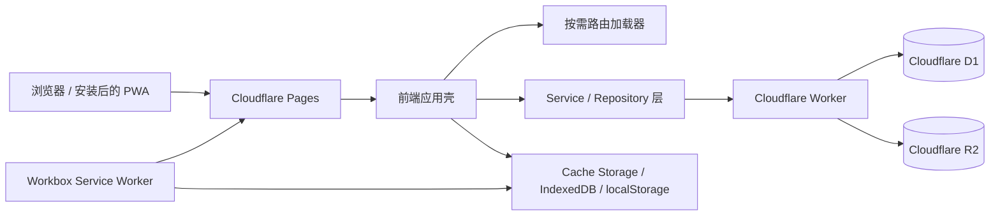

# 咻蛋之家技术总览

> 当前系统事实的长期入口。最后核验：2026-09-01。
>
> 正式站：<https://life-vlog-site.pages.dev/>

## 1. 产品与技术边界

咻蛋之家是家庭成员共同使用的生活记录 PWA，主要功能包括日记与 VLOG、心情日记、评论和收藏、菜谱、心愿与购物、周末计划、衣柜、纪念日、家庭动态、通知和秘藏相册。

项目采用原生 ES Modules，不使用 React/Vue 等 UI 框架：

- 前端：HTML、CSS、JavaScript ES Modules、Vite。
- PWA：`vite-plugin-pwa` + Workbox `injectManifest`。
- 后端：Cloudflare Worker。
- 数据库：Cloudflare D1。
- 媒体：Cloudflare R2，公开展示通过 `PUBLIC_R2_URL`，写入和删除通过 Worker。
- 托管：Cloudflare Pages。

## 2. 系统结构



浏览器只通过应用的 service/repository 边界访问远端数据。控制器不应直接构造传输客户端；视图不应包含权限和持久化规则。

## 3. 前端启动与装配

入口链路：

1. `index.html` 提供首屏应用壳、日记首页和全局对话框基础结构。
2. `app.js` 只导入 `modules/app-runtime-startup.js` 并启动应用。
3. `app-runtime-*` 系列模块创建状态、服务、控制器、事件绑定和路由上下文。
4. `app-services.js` 集中创建 Cloudflare 客户端、repositories、媒体缓存、上传队列和图片服务。
5. `app-startup-controller.js` 先释放可用 UI，再在后台同步会话与云端数据。
6. `route-loader.js` 按页面动态导入路由模块，依次执行 `mount → collect → initialize → bind → activate`。

`app.js` 不承载业务逻辑。新增功能按职责进入 `modules/`，并保持 controller、view、domain、repository/service 分离。

顶部分页由 `primary-navigation-controller.js` 在应用壳装配时接管：访客先使用默认可见入口，session 建立后按用户/设备作用域应用配置；设置路由在模板渲染完成后才绑定 Push 设置按钮和顶部分页设置。设置页不依赖提前加载的懒路由 DOM。

移动端页面契约由主入口和基础样式共同维护：`index.html` 只有一个固定的 viewport（`width=device-width`、`initial-scale=1.0`、`minimum-scale=1.0`、`maximum-scale=1.0`、`user-scalable=no`、`viewport-fit=cover`）；手机与短横屏上的可见文本输入、`select` 和 `textarea` 的计算字号至少为 16px，并随动态字号根设置放大。页面保留纵向滚动和系统返回手势，不使用 `html/body` 的全局横向溢出遮罩、全局 `touch-action: none` 或全局 `touchmove` 拦截；照片查看器和下拉刷新只在各自的媒体/日记区域维护局部手势边界。

通知铃铛属于应用外壳能力，由 `app-event-bindings.js` 在 shell 初始化时调用 `notification-event-bindings.js` 绑定一次，不依赖设置路由。`openNotificationsPanel()` 先同步打开 dialog，再复用共享的 `notificationsLoadPromise` 异步加载；视图区分缓存加载、空状态和错误状态，错误提供重试，加载期间关闭 dialog 不会在请求完成后重新打开，关闭事件恢复铃铛焦点。通知读取/标记已读失败都必须被控制器吸收为可读状态，不能产生未处理 Promise rejection。

## 4. 页面与路由

`modules/route-loader.js` 是路由模块注册表：

| 页面 | 路由模块 | 说明 |
| --- | --- | --- |
| 日记 / VLOG | `routes/gallery-route.js` | 首屏页面；列表、筛选、详情按需装配 |
| 菜谱 | `routes/recipes-route.js` | 家庭菜谱 |
| 心愿 / 购物 | `routes/wishlist-route.js` | 心愿与购物共享入口 |
| 周末 | `routes/weekend-route.js` | 周末计划和回顾 |
| 衣柜 | `routes/wardrobe-route.js` | 衣柜记录 |
| 留言 | `routes/thanks-route.js` | 家庭感谢与留言 |
| 心情 | `routes/mood-diary-route.js` | 完整月历、玻璃心情罐、最多心情、趋势、详情、编辑和历史 |
| 秘藏 | `routes/secret-route.js` | 私密相册、文件夹、筛选和解锁 |
| 设置 | `routes/settings-route.js` | 五组设置和数据工具 |

除 gallery 外的主要页面模板位于 `modules/routes/templates/`。路由状态由导航控制器维护，快速切换采用 latest-wins 事务，过期加载不得重新激活页面。

首页的今日心情概览属于应用壳，不是独立路由：`today-mood-controller.js` 通过 `listDay(YYYY-MM-DD)` 读取 Asia/Tokyo 当天记录并过滤为稳定两席。应用壳同时装配唯一的 `mood-entry-overlay-controller.js`；gallery 概览与懒加载 mood 日历都向它传入日期、两席记录、参与者和触发元素，共用 Picker、编辑、详情、权限及写入流程。保存/删除后 overlay 同时通知月历内存状态与概览单日刷新；账户同步完成后若家庭席位晚到，route assembly 调用 mood controller 的 `refreshContext()` 重新建立参与者并重读当前月份。

首次登录态 gallery 激活时，`app-navigation-controller.js` 负责一次性的首页落点。概览席位不切路由：已记录席位原地打开详情，本人空席原地打开 Picker，对方空席不可编辑；overlay 用同 URL history entry 支持 Back 关闭，并恢复打开时的 scrollY 与触发焦点。顶部不再提供心情分页按钮，`?page=mood` 深链接和概览日历 CTA 继续进入月历。

一级导航的注册表、默认顺序和可选入口由 `primary-navigation-domain.js` 维护。默认顺序为“日记、VLOG、心愿、周末、衣柜”，菜谱、留言、秘藏默认关闭；日记始终启用。VLOG 是筛选 mode，不产生 `?page=vlog`，心情不占用一级导航但保留 mood 深链接和日历 CTA。`primary-navigation-view.js` 只渲染当前可见入口与设置列表，`primary-navigation-controller.js` 负责按作用域读写、启用/禁用和上下移动。

## 5. 分层约定

| 层 | 命名 | 职责 |
| --- | --- | --- |
| Domain | `*-domain.js` | 纯计算、筛选、排序、状态决策；不读写 DOM 和网络 |
| View | `*-view.js` | 生成或更新 DOM；不决定权限和持久化 |
| Controller | `*-controller.js` | 编排交互、异步流程、状态和 view/domain |
| Repository | `data-repositories.js`, `*-repository.js` | D1/API 数据访问边界 |
| Service | `*-service.js` | 跨控制器基础能力，如媒体、缓存、上传和秘藏同步 |
| Assembly | `app-runtime-*-assembly.js` | 依赖注入与模块装配，不放业务规则 |

具体功能定位见 [`MODULE_MAP.md`](MODULE_MAP.md)。

通知模块保持三层边界：`notification-event-bindings.js` 只负责 DOM 事件，`social-controller.js` 编排加载、已读和跳转，`notification-view.js` 负责列表及 loading/empty/error/retry 状态；通知数据仍通过 `data-repositories.js` 的 Worker/D1 repository 访问。

## 6. 数据与后端

### 6.1 Worker

`cloudflare-worker/src/worker.js` 负责 API、认证、限流、R2 上传/删除和服务端权限。`wrangler.toml` 声明 D1、R2 和环境绑定。

前端不得绕开 Worker 执行需要权限的写操作。允许公开读取的媒体使用规范化后的 R2 公共 URL。

### 6.2 D1

`cloudflare-worker/schema.d1.sql` 是当前完整数据库结构的事实来源。按照项目规则，新增结构直接更新完整 schema，不为旧实现增加兼容层、双读写或临时 migration。

主要数据域：账号与家庭、日记、心情日记、媒体元数据、评论、收藏、菜谱、心愿、购物、周末计划、纪念日、通知、回收站和秘藏。

心情日记使用 `mood_diaries`：`(user_id, diary_date)` 唯一约束保证每位成员每天一条；读取按家庭范围授权，写入、编辑和删除按当前 session 的 `user_id` 限制。`diary_date` 是 Asia/Tokyo 的自然日，月份查询使用 `[diary_date >= monthStart, diary_date < nextMonthStart)`，Worker 同时校验真实日期、未来日期、八种枚举心情、5000 Unicode 字符正文和最多八个 20 字符标签。`TABLE_CONFIG` 记录 family read / own write / `tags` JSON / conflict columns，D1 导出和每日备份包含该表。

数据库结构不会由普通 Pages 发布自动变更；需要部署结构时必须显式执行 D1 命令，并在 `CHANGELOG.md` 记录影响和执行结果。

### 6.3 R2 媒体

- D1 中持久化的 `r2:` path 是媒体身份的可信来源。
- `diary-media-domain.js` 将 path 规范化为公开展示 URL。
- 上传、删除和审计通过 Worker 与 `image-service.js` / `asset-controller.js` 完成。
- 列表使用 thumbnail/poster，详情使用完整图片或视频。
- 删除业务先进入 D1 回收站，再清理关联资源；不得仅凭展示 URL 推断删除权限。

## 7. 日记与视频媒体

日记列表主要由以下模块负责：

- `diary-feed-controller.js`：加载、筛选、分页和列表编排。
- `diary-domain.js`：搜索、分类和筛选纯逻辑。
- `diary-media-domain.js`：媒体 URL 规范化。
- `diary-gallery-view.js`：卡片、poster、错误恢复和徽标。
- `diary-feed-motion-domain.js`：视觉中心候选与时长策略。
- `diary-feed-motion-coordinator.js`：单实例、静音的列表动态预览生命周期。
- `photo-detail-controller.js` / `photo-viewer-controller.js`：详情与用户控制播放。

列表动态预览契约：

- 普通视频和 Live Photo 初始都先显示 poster。
- 整个 feed 同时最多一个动态预览，选择最接近视口视觉中心的候选。
- 列表预览始终静音、内联、不可抢占点击；进入日记/VLOG 详情后，普通视频自动静音播放并保留原生控件，用户可通过控件开启声音。
- 时长不超过 8 秒可循环，超过 8 秒不循环。
- reduced-motion、save-data、页面隐藏、离屏和路由离开时停止或禁用预览。
- `VIDEO` / `LIVE` 徽标必须在桌面和手机、单图和拼图中保持可见。

## 8. 本地状态、缓存与离线

- `preferences-store.js`：主题、字号、布局和顶部分页等设备偏好。
- `upload-queue.js`：IndexedDB 上传队列与失败重试。
- `media-cache.js` / `offline-cache-controller.js`：日记和秘藏媒体缓存。
- `offline-records.js`：离线元数据记录。
- `src/sw.js`：Workbox 预缓存和运行时缓存策略。

Service Worker 使用 `registerType: "prompt"`，新版本就绪后由用户确认更新。路由 chunk 和大媒体不进入核心 precache，避免安装包过大。

心情日记的当前月份在 `localStorage` 使用 `life-vlog-mood-month:<userId>:<YYYY-MM>` 缓存，仅作为加速层；云端成功响应会替换 canonical 内容，用户、月份和请求 revision 均参与隔离与 latest-wins 判断。`monthSummary` 不单独持久化，而是由当前月 entries、稳定两席和月份键派生；`mood-month-summary-domain.js` 同时生成最多 62 个确定性罐体安全槽位、成员最多心情、按日三档趋势（缺口只保留真实端点并输出虚线桥）、数量自适应慢动画批次和真实日期趋势坐标。`mood-month-summary-view.js` 观察罐体约 35% 进入视口后只播放当前月份/数据 key 的一次动画；外层固定 `left/top`，仅内层素材从 360×440 坐标系的 `(180,52)` 椭圆罐口锚点移动。瓶体本身是原生重播按钮，重播会取消旧动画并把焦点留在按钮；路由离开会断开观察器、取消动画并显式收束状态。手机趋势使用约 `390×360` 的高画布，记录较少时按真实有记录日期等距展开，HTML 命中按钮与 SVG 绘图共用同一坐标模型。首页今日概览使用独立的单日查询，不读取该月缓存。保存、编辑、删除先更新月历/历史/详情/汇总的内存快照，再强制重读受影响月份；成功响应覆盖 optimistic state，重读失败保留已写入结果并显示可重试状态；没有离线写入队列。

顶部分页配置使用现有 `preferences-store.js` 的 `life-vlog-primary-navigation` key，按现有 user/device scope 隔离；只保存启用状态与顺序，不新增数据库、云端字段或依赖。关闭本机 Push 时先执行浏览器订阅的 `unsubscribe()`，再清理 Worker 记录；远端失败只反馈“本机已关闭、云端记录清理失败”，不阻断本地状态。

## 9. 构建与资源

开发和构建：

```powershell
pnpm install --frozen-lockfile
pnpm dev
pnpm build
pnpm preview
```

`vite.config.js` 负责：

- 输出 `dist/` 和带 hash 的资源；
- 使用仓库锁定的 Terser 压缩 JavaScript，满足入口体积预算；
- 复制 `assets/generated/`；
- 压缩最终 `index.html`；
- 生成 PWA manifest；
- 通过 Workbox `injectManifest` 生成 `dist/sw.js`。

今日心情的 controller、repository 与共享域模块固定合并为单个 `today-mood-*.js` 懒加载 chunk；overlay 仍在首次打开时才加载，gallery 冷启动保持最多 28 个请求，路由 chunk 继续排除在核心 Workbox precache 之外。

`pnpm-workspace.yaml` 明确允许 `esbuild` 与 `sharp` 的安装构建脚本，使锁定依赖安装后的 Vite 构建使用完整的本地二进制依赖。

源图片位于 `assets-source/`，`scripts/optimize-assets.mjs` 生成确定性资源到 `assets/generated/`。不要手工编辑生成文件来替代源文件和优化脚本。

顶部分页和筛选样式只修改规范源码；每次构建由 Vite 重新生成带 hash 的入口资源，不能直接编辑 `dist/` 或用旧 hash 资源掩盖源码版本漂移。本次本地验收只完成构建和本地 fixture 检查，未执行 preview/production 部署。

## 10. 测试体系

| 命令 | 覆盖范围 |
| --- | --- |
| `pnpm test` | 语法、单元、静态契约、结构健康、资源优化、构建预算、CSS 覆盖和浏览器回归 |
| `pnpm run test:a11y` | Axe critical/serious；桌面、手机、横屏、主题、字号和 reduced-motion 矩阵 |
| `pnpm run test:build` | 构建与资源体积预算 |
| `pnpm run test:release` | 确定性线上 fixture 冒烟 |
| `pnpm run test:worker-online` | Worker CORS 与在线边界 |

心情日记专项由 `tests/mood-diary-domain.mjs`、`tests/mood-month-summary-domain.mjs`、`tests/mood-diary-controller.mjs`、`tests/today-mood-controller.mjs`、`tests/mood-diary-worker.mjs`、`tests/mood-diary-assets.mjs` 和 `tests/mood-diary-browser.mjs` 覆盖；浏览器用确定性假 session / API fixture 验证首页今日概览的四种数据状态、真实昵称/形状、本人快速添加、冷启动落点、gallery 滚动恢复，以及 375/390/430/768/844×390/1440 视口的完整月历、月度汇总、360×440 罐体与前后层实际 bbox/clip、0/1/8/31/62 数量计划、离屏/进视口/回滚动动画生命周期、慢速重播/中断/键盘/减少动态效果、月份切换和路由离开清理、稠密罐体边界、趋势 SVG `getTotalLength()`/点 bbox/计算字体/线宽/颜色、真实日期横向覆盖、44×44 点位命中区、单一键盘焦点、趋势点键盘提示、暗色/130% 字号、缓存错误重试、写后 canonical 重读、Picker、编辑、删除、历史和横向溢出。16 个 512×512 透明心情素材位于 Vite 静态目录 `public/assets/mood-diary/`，构建后 URL 为 `/assets/mood-diary/*`；静态门禁会验证精确文件集合、PNG/Alpha、透明安全区和单文件体积，避免白底、棋盘格或缺失素材进入发布包。

`pnpm test` 不包含全部发布门禁。发布必须遵循 [`release-checklist.md`](release-checklist.md)。浏览器回归和 release smoke 使用确定性通知 fixture 覆盖铃铛在设置路由未加载、慢请求、重复点击、关闭中请求、读取失败重试、已读写回和跳转场景下的行为；同时覆盖顶部分页默认/可选入口、启用排序持久化、VLOG mode 不改 URL、导航局部横向滚动、日记搜索/tag 随页面文档流滚动和 Push 本地优先关闭。a11y 回归同时检查上述 viewport、无横向溢出和移动端表单字号契约。

## 11. 部署

标准入口：

```powershell
powershell -NoProfile -ExecutionPolicy Bypass -File .\deploy-cloudflare-pages.ps1 -Environment preview
powershell -NoProfile -ExecutionPolicy Bypass -File .\deploy-cloudflare-pages.ps1 -Environment production
```

部署脚本会安装锁定依赖、运行测试、构建、部署 Worker、检查 CORS、部署固定 preview，再按参数部署 production，并对别名运行 Axe 和 release smoke。

Cloudflare token 只能通过环境变量或脚本已有的本机 token 文件读取，禁止写入仓库、日志或文档。

## 12. 长期工程规则

- 不保留向后兼容层、fallback、双实现或临时迁移。
- 优先复用现有依赖和模块。
- UI 任务必须使用 `ui-ux-pro-max` 并完成响应式、触控、主题和无障碍检查。
- 不修改或清理不属于当前任务的工作树内容。
- 每次修改都必须按 [`CHANGE_WORKFLOW.md`](CHANGE_WORKFLOW.md) 更新 `CHANGELOG.md` 和受影响的技术文档。
