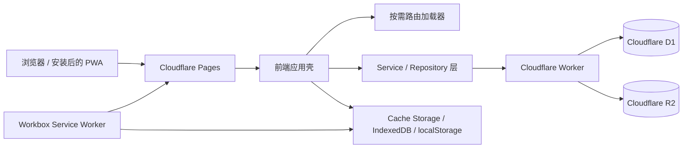

# 咻蛋之家技术总览

> 当前系统事实的长期入口。最后核验：2026-08-30。
>
> 正式站：<https://life-vlog-site.pages.dev/>

## 1. 产品与技术边界

咻蛋之家是家庭成员共同使用的生活记录 PWA，主要功能包括日记与 VLOG、评论和收藏、菜谱、心愿与购物、周末计划、衣柜、纪念日、家庭动态、通知和秘藏相册。

项目采用原生 ES Modules，不使用 React/Vue 等 UI 框架：

- 前端：HTML、CSS、JavaScript ES Modules、Vite。
- PWA：`vite-plugin-pwa` + Workbox `injectManifest`。
- 后端：Cloudflare Worker。
- 数据库：Cloudflare D1。
- 媒体：Cloudflare R2，公开展示通过 `PUBLIC_R2_URL`，写入和删除通过 Worker。
- 托管：Cloudflare Pages。

## 2. 系统结构



浏览器只通过应用的 service/repository 边界访问远端数据。控制器不应直接构造传输客户端；视图不应包含权限和持久化规则。

## 3. 前端启动与装配

入口链路：

1. `index.html` 提供首屏应用壳、日记首页和全局对话框基础结构。
2. `app.js` 只导入 `modules/app-runtime-startup.js` 并启动应用。
3. `app-runtime-*` 系列模块创建状态、服务、控制器、事件绑定和路由上下文。
4. `app-services.js` 集中创建 Cloudflare 客户端、repositories、媒体缓存、上传队列和图片服务。
5. `app-startup-controller.js` 先释放可用 UI，再在后台同步会话与云端数据。
6. `route-loader.js` 按页面动态导入路由模块，依次执行 `mount → collect → initialize → bind → activate`。

`app.js` 不承载业务逻辑。新增功能按职责进入 `modules/`，并保持 controller、view、domain、repository/service 分离。

## 4. 页面与路由

`modules/route-loader.js` 是路由模块注册表：

| 页面 | 路由模块 | 说明 |
| --- | --- | --- |
| 日记 / VLOG | `routes/gallery-route.js` | 首屏页面；列表、筛选、详情按需装配 |
| 菜谱 | `routes/recipes-route.js` | 家庭菜谱 |
| 心愿 / 购物 | `routes/wishlist-route.js` | 心愿与购物共享入口 |
| 周末 | `routes/weekend-route.js` | 周末计划和回顾 |
| 衣柜 | `routes/wardrobe-route.js` | 衣柜记录 |
| 留言 | `routes/thanks-route.js` | 家庭感谢与留言 |
| 秘藏 | `routes/secret-route.js` | 私密相册、文件夹、筛选和解锁 |
| 设置 | `routes/settings-route.js` | 五组设置和数据工具 |

除 gallery 外的主要页面模板位于 `modules/routes/templates/`。路由状态由导航控制器维护，快速切换采用 latest-wins 事务，过期加载不得重新激活页面。

## 5. 分层约定

| 层 | 命名 | 职责 |
| --- | --- | --- |
| Domain | `*-domain.js` | 纯计算、筛选、排序、状态决策；不读写 DOM 和网络 |
| View | `*-view.js` | 生成或更新 DOM；不决定权限和持久化 |
| Controller | `*-controller.js` | 编排交互、异步流程、状态和 view/domain |
| Repository | `data-repositories.js`, `*-repository.js` | D1/API 数据访问边界 |
| Service | `*-service.js` | 跨控制器基础能力，如媒体、缓存、上传和秘藏同步 |
| Assembly | `app-runtime-*-assembly.js` | 依赖注入与模块装配，不放业务规则 |

具体功能定位见 [`MODULE_MAP.md`](MODULE_MAP.md)。

## 6. 数据与后端

### 6.1 Worker

`cloudflare-worker/src/worker.js` 负责 API、认证、限流、R2 上传/删除和服务端权限。`wrangler.toml` 声明 D1、R2 和环境绑定。

前端不得绕开 Worker 执行需要权限的写操作。允许公开读取的媒体使用规范化后的 R2 公共 URL。

### 6.2 D1

`cloudflare-worker/schema.d1.sql` 是当前完整数据库结构的事实来源。按照项目规则，新增结构直接更新完整 schema，不为旧实现增加兼容层、双读写或临时 migration。

主要数据域：账号与家庭、日记、媒体元数据、评论、收藏、菜谱、心愿、购物、周末计划、纪念日、通知、回收站和秘藏。

数据库结构不会由普通 Pages 发布自动变更；需要部署结构时必须显式执行 D1 命令，并在 `CHANGELOG.md` 记录影响和执行结果。

### 6.3 R2 媒体

- D1 中持久化的 `r2:` path 是媒体身份的可信来源。
- `diary-media-domain.js` 将 path 规范化为公开展示 URL。
- 上传、删除和审计通过 Worker 与 `image-service.js` / `asset-controller.js` 完成。
- 列表使用 thumbnail/poster，详情使用完整图片或视频。
- 删除业务先进入 D1 回收站，再清理关联资源；不得仅凭展示 URL 推断删除权限。

## 7. 日记与视频媒体

日记列表主要由以下模块负责：

- `diary-feed-controller.js`：加载、筛选、分页和列表编排。
- `diary-domain.js`：搜索、分类和筛选纯逻辑。
- `diary-media-domain.js`：媒体 URL 规范化。
- `diary-gallery-view.js`：卡片、poster、错误恢复和徽标。
- `diary-feed-motion-domain.js`：视觉中心候选与时长策略。
- `diary-feed-motion-coordinator.js`：单实例、静音的列表动态预览生命周期。
- `photo-detail-controller.js` / `photo-viewer-controller.js`：详情与用户控制播放。

列表动态预览契约：

- 普通视频和 Live Photo 初始都先显示 poster。
- 整个 feed 同时最多一个动态预览，选择最接近视口视觉中心的候选。
- 预览始终静音、内联、不可抢占点击；详情播放器由用户控制声音。
- 时长不超过 8 秒可循环，超过 8 秒不循环。
- reduced-motion、save-data、页面隐藏、离屏和路由离开时停止或禁用预览。
- `VIDEO` / `LIVE` 徽标必须在桌面和手机、单图和拼图中保持可见。

## 8. 本地状态、缓存与离线

- `preferences-store.js`：主题、字号、布局等设备偏好。
- `upload-queue.js`：IndexedDB 上传队列与失败重试。
- `media-cache.js` / `offline-cache-controller.js`：日记和秘藏媒体缓存。
- `offline-records.js`：离线元数据记录。
- `src/sw.js`：Workbox 预缓存和运行时缓存策略。

Service Worker 使用 `registerType: "prompt"`，新版本就绪后由用户确认更新。路由 chunk 和大媒体不进入核心 precache，避免安装包过大。

## 9. 构建与资源

开发和构建：

```powershell
pnpm install --frozen-lockfile
pnpm dev
pnpm build
pnpm preview
```

`vite.config.js` 负责：

- 输出 `dist/` 和带 hash 的资源；
- 复制 `assets/generated/`；
- 压缩最终 `index.html`；
- 生成 PWA manifest；
- 通过 Workbox `injectManifest` 生成 `dist/sw.js`。

源图片位于 `assets-source/`，`scripts/optimize-assets.mjs` 生成确定性资源到 `assets/generated/`。不要手工编辑生成文件来替代源文件和优化脚本。

## 10. 测试体系

| 命令 | 覆盖范围 |
| --- | --- |
| `pnpm test` | 语法、单元、静态契约、结构健康、资源优化、构建预算、CSS 覆盖和浏览器回归 |
| `pnpm run test:a11y` | Axe critical/serious；桌面、手机、横屏、主题、字号和 reduced-motion 矩阵 |
| `pnpm run test:build` | 构建与资源体积预算 |
| `pnpm run test:release` | 确定性线上 fixture 冒烟 |
| `pnpm run test:worker-online` | Worker CORS 与在线边界 |

`pnpm test` 不包含全部发布门禁。发布必须遵循 [`release-checklist.md`](release-checklist.md)。

## 11. 部署

标准入口：

```powershell
powershell -NoProfile -ExecutionPolicy Bypass -File .\deploy-cloudflare-pages.ps1 -Environment preview
powershell -NoProfile -ExecutionPolicy Bypass -File .\deploy-cloudflare-pages.ps1 -Environment production
```

部署脚本会安装锁定依赖、运行测试、构建、部署 Worker、检查 CORS、部署固定 preview，再按参数部署 production，并对别名运行 Axe 和 release smoke。

Cloudflare token 只能通过环境变量或脚本已有的本机 token 文件读取，禁止写入仓库、日志或文档。

## 12. 长期工程规则

- 不保留向后兼容层、fallback、双实现或临时迁移。
- 优先复用现有依赖和模块。
- UI 任务必须使用 `ui-ux-pro-max` 并完成响应式、触控、主题和无障碍检查。
- 不修改或清理不属于当前任务的工作树内容。
- 每次修改都必须按 [`CHANGE_WORKFLOW.md`](CHANGE_WORKFLOW.md) 更新 `CHANGELOG.md` 和受影响的技术文档。
