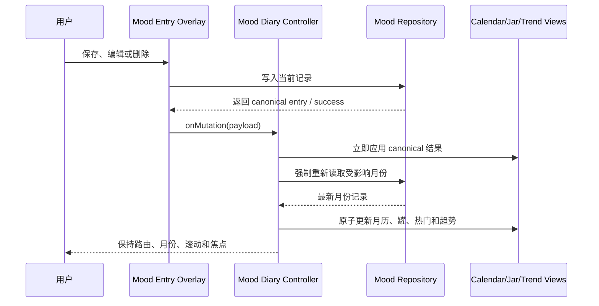

# 心情日记完整月历、玻璃心情罐与趋势曲线规划

> 状态：Implemented（本地已实现并完成 fixture 门禁，未部署）
> 日期：2026-09-01
> 范围：心情日记路由的月视图、月度汇总、保存后刷新与“全部日记”入口位置
> 参考：用户提供的三张手机截图；复刻其功能、信息层级和交互结果，视觉继续遵守本项目设计系统，不复制第三方品牌、水印或无关装饰。

## 1. 目标

本轮把心情日记从“高卡片月历”升级为一个完整的月度回顾页面：

1. 进入心情日记后，优先看到月份切换和完整当月日历，不再被大标题、说明和顶部按钮占据首屏。
2. 日历必须渲染当月全部日期和两位家庭成员的当天心情，四周、五周、六周月份都不能裁掉最后一行。
3. 当月所有心情以现有圆形/方形素材落入玻璃罐中，形成直观的月度心情集合。
4. 玻璃罐下方显示每位成员的本月最多心情和次数。
5. 再下方显示两位成员按日期变化的心情趋势曲线。
6. “全部日记”移到月度内容最底部，不再放在页面标题区域。
7. 新建、编辑或删除心情成功后，不整页刷新、不跳转路由；当前心情页立即更新，并重新获取当前月份的最新云端状态。
8. 移除可见的“Mood Diary / 心情日记 / 说明”标题块；保留仅供页面焦点和辅助技术使用的语义标题。

## 2. 当前问题与根因

### 2.1 月份看起来没有完整显示

当前 `modules/mood-diary-domain.js` 的 `buildCalendarWeeks()` 已经会生成完整的 4～6 周月历，因此问题不在日期数据缺失，而在手机布局密度：

- `styles/mood-diary.css` 在手机端仍给每个日期格设置至少 `94px` 高度。
- 每位成员的心情使用纵向排列，并同时显示图片与心情文字。
- 页面上方还有大号“心情日记”标题、英文 kicker、说明文字和全宽“全部日记”按钮。
- 六周月份仅网格本身就需要约 `6 × 94px`，再叠加月份工具栏、星期栏、顶部应用壳和安全区，最后一行会落到很深的位置，用户第一眼只能看到当月的一部分。

### 2.2 月度回顾信息不足

当前月份查询已经返回两位成员的整月心情，但只用于日历格，没有进一步生成：

- 月度心情罐；
- 每位成员的最高频心情；
- 按日期排列的趋势数据；
- 月度记录数量和可读摘要。

不需要新增数据库或 API；现有 `listMonth(monthKey)` 已足够提供本功能所需数据。

### 2.3 保存后没有重新获取当前月规范状态

共享 overlay 保存成功后会调用 `moodDiary.handleMutation()`：

- 当前实现会把保存结果写入页面内存并立即 render；
- 首页今日概览会单独 refresh；
- 但心情日记路由不会强制重新调用 `listMonth()`。

因此页面通常能看到乐观更新，但没有再次与当前月份的云端规范结果对齐。新玻璃罐和趋势图增加后，这个边界必须明确修复。

## 3. 最终页面结构

登录后的月视图按以下顺序排列：

```text
月份切换：上一月        2026 年 9 月        下一月
星期栏
完整月历（4～6 周、两位成员每日各一枚心情）
成员形状/昵称图例

本月心情罐
┌─────────────────────┐
│     透明玻璃罐轮廓      │
│  当月心情从罐口落下并堆叠 │
└─────────────────────┘
当月记录数与可读摘要

本月最多心情
成员 1：头像 + 心情素材 + 名称 + ×次数
成员 2：头像 + 心情素材 + 名称 + ×次数

心情趋势
两位成员折线、图例、日期刻度、点选详情
可展开的趋势数据明细

[ 全部日记 ]
```

页面仍保留“记录今天心情”的浮动按钮；它不替代底部“全部日记”。未登录态和未建立家庭的现有提示保持可用。

## 4. 完整月历设计

### 4.1 信息规则

- 月历使用周一到周日七列。
- 必须渲染当前月份所有自然日，支持 28、29、30、31 天和跨年月份。
- 为保持首屏紧凑，非当前月的前导/尾随格只承担对齐，不显示边框或日期。
- 每个日期最多显示两枚素材，严格按照家庭稳定席位排序：成员 1 方形、成员 2 圆形。
- 手机端日期格不再显示“开心/平静”等重复文字；完整信息写入按钮 `aria-label`，并通过下方成员图例说明形状归属。
- 桌面端可保留简短心情名称，但不得改变两枚素材的稳定顺序。
- 今天继续有边框/文字标识，不能只靠颜色区分。
- 未来日期保持不可记录，使用真实 disabled/`aria-disabled` 语义和清晰视觉状态。

### 4.2 手机密度

- 支持宽度：375、390、430px；同时验证 844×390 横屏。
- 日期按钮在 375px 下仍至少约 44×64px，满足触控宽度与高度。
- 手机日期格目标高度约 64～76px，素材约 20～24px；两位成员上下排列。
- 星期栏、月份工具栏和网格之间使用 4/8px 节奏。
- 网格不设置独立滚动容器，不使用横向滚动，也不通过 `overflow: hidden` 掩盖裁切。
- 4、5、6 周月份均完整生成；在目标手机宽度下最后一行必须可见且不与底部安全区或浮动按钮重叠。
- 130% 应用字号下日期仍完整，素材不变形，页面允许自然纵向滚动但不能丢失日期行。

### 4.3 移除可见标题

删除当前可见的：

- `Mood Diary` kicker；
- 大号“心情日记”标题；
- “把今天的心情，留给未来的自己”说明；
- 标题区中的“全部日记”。

为了保持路由切换后的焦点管理和标题层级，保留一个 `visually-hidden` 的页面主标题，并继续带 `data-page-heading="mood"`。用户看不到标题块，但屏幕阅读器仍能识别页面。

## 5. 玻璃心情罐

### 5.1 视觉实现

- 玻璃罐使用项目内 HTML/CSS + 内联 SVG 轮廓绘制，不引入新的位图背景或第三方品牌素材。
- 罐体保持项目深浅主题：透明表面、克制高光、清晰边线，不增加大面积 glow 或装饰性重玻璃拟态。
- 罐内继续使用现有 16 张透明心情素材：成员 1 方形、成员 2 圆形。
- 罐体预留固定 `aspect-ratio`，加载前后尺寸稳定，避免 CLS。
- 最多展示当月两位成员每天各一条，即最多 62 枚；不得因为记录多而溢出罐壁。
- 罐内素材仅作汇总视觉，`pointer-events: none`、`aria-hidden="true"`；罐旁提供可读的总数与成员汇总，避免辅助技术重复朗读几十张装饰图。

### 5.2 稳定堆叠算法

新增纯领域算法，为每条记录生成稳定的归一化位置：

- 先按日期、席位和记录 ID 排序；
- 从罐底向上使用交错网格/六边形槽位堆叠；
- 使用记录 ID 的稳定哈希产生小范围横向偏移和旋转；
- 同一批数据重复 render 时位置完全一致，不使用 `Math.random()`；
- 宽度变化时只根据归一化坐标缩放，不重新洗牌；
- 删除后允许重新压实，保存一条新记录只新增或更新对应素材。

该方案提供“落入并堆在罐中”的感受，同时避免引入物理引擎、Canvas 碰撞模拟和不可预测布局。

### 5.3 下落动画

- 动画只使用 `transform` 和 `opacity`，不动画 top/left/width/height。
- 首次完成当前月份加载或切换月份时，从罐口按日期顺序分批下落到稳定位置。
- 总动画时长控制在约 900～1200ms，不按 62 枚逐个长时间排队；记录多时采用小批次并行。
- 每枚素材使用短距离回弹表达“落入罐底”，不能无限弹跳或持续漂浮。
- 普通 render、焦点变化、状态提示和窗口轻微变化不得重复播放整罐动画。
- 保存新心情后只播放新增/变化的素材；删除后用短淡出并重新压实，不重放全部素材。
- 月份请求失败时保留已有缓存罐，显示“当前为缓存”状态，不清空后再闪回。
- `prefers-reduced-motion: reduce` 时完全跳过下落和回弹，直接显示最终堆叠状态。
- 不引入 GSAP；优先使用 Web Animations API 或项目现有 CSS 动画能力。

## 6. 本月最多心情

每位稳定参与者显示一张紧凑汇总项：

- 真实头像和昵称；
- 对应形状的最高频心情素材；
- 心情名称；
- `×N` 次数；
- 该成员本月总记录数。

确定性规则：

1. 仅统计当前月份、当前家庭稳定两席的规范记录。
2. 按出现次数降序。
3. 次数相同时，优先最近出现的心情。
4. 仍相同时，按 `MOOD_TYPES` 的固定顺序决定，避免刷新后抖动。
5. 无记录成员显示“本月还没有记录”，不显示假数据或 0 次热门心情。

## 7. 心情趋势曲线

### 7.1 数据表达

现有八种心情是分类数据，不应伪装成医学或心理健康评分。趋势图只提供“月内相对状态”展示，并显示说明：

> 趋势用于回顾本月心情起伏，不代表健康评估。

使用三档展示层级：

- 高涨：`happy`、`heart`、`excited`；
- 平稳：`calm`、`tired`；
- 低落：`annoyed`、`sad`、`angry`。

每个数据点仍保留真实心情类型；纵向位置只使用上述三档，不改变原始记录。

### 7.2 SVG 实现

- 使用原生响应式 SVG，不新增 Chart.js/D3 等依赖；每月最多 31×2 个点，SVG 足够。
- 横轴为当月 1～最后一天；在手机端显示稀疏刻度，桌面端可增加刻度。
- 纵轴显示“高涨 / 平稳 / 低落”文字和代表性素材，不能只显示颜色。
- 两位成员使用不同颜色，同时使用实线/虚线及不同点形，不能仅靠色相区分。
- 没有记录的日期不补造数据；跨空白日期不画成连续实线，可分段或使用明确的断点。
- 单个数据点也必须可见，不依赖两点成线。
- 点支持点击、触摸和键盘聚焦，展示“日期、昵称、真实心情”的小提示。
- 图表下提供可展开的按日期数据明细和一段文本摘要，作为辅助技术和精确阅读的替代。
- 空月份显示有操作入口的空态，不渲染一条假水平线。

## 8. “全部日记”入口

- 从页面顶部删除 `#moodListOpen`。
- 在月历、玻璃罐、热门心情和趋势之后放置唯一的全宽“全部日记”按钮。
- 点击后继续进入现有 history/list 视图，不创建新路由和第二套历史实现。
- 历史视图保留清晰的“回到本月”动作；返回后恢复之前浏览的月份与滚动位置。
- 按钮至少 44px 高，不能被浮动记录按钮或底部安全区遮挡。

## 9. 保存、编辑、删除后的自动刷新

禁止使用 `window.location.reload()`。刷新应是当前路由内的数据同步：



具体规则：

- `handleMutation()` 改为可等待的异步流程。
- 先使用 overlay 返回的 canonical entry 更新内存，使用户立即看到变化。
- 如果受影响日期属于当前浏览月份，随后执行 `loadMonth(currentMonthKey, { force: true, reason: "mutation" })`。
- 刷新响应必须继续受现有 request revision/latest-wins 保护；旧月份响应不能覆盖新月份。
- 云端重新读取成功后一次性派生月历分组、罐位置、热门统计和趋势数据，再统一 render。
- 保存当前月份的新记录时，只给受影响素材播放新增动画。
- 删除后更新四个区域并保持当前滚动位置。
- 若重新读取失败，保留已经成功写入的 canonical 结果，显示“已保存，但本月汇总同步失败，可重试”，不得把成功保存误报为失败。
- 如果当前显示“全部日记”，更新或删除后同步更新列表；必要时后台执行 `loadHistory({ force: true })`，但不强制返回月视图。
- 首页今日概览继续独立 refresh；两个刷新可以并行，但不得相互覆盖状态。

## 10. 模块方案

### 10.1 新增模块

#### `modules/mood-month-summary-domain.js`

纯逻辑，负责：

- 当前月记录过滤和排序；
- 两位成员计数；
- 每位成员最高频心情和确定性 tie-break；
- 三档趋势映射和按日 series；
- 玻璃罐稳定槽位与 hash 偏移；
- 月度总数和可读摘要。

不得访问 DOM、网络、localStorage 或动画 API。

#### `modules/mood-month-summary-view.js`

负责：

- 玻璃罐 SVG/DOM；
- 心情素材堆叠和进入/删除动画；
- 本月最多心情卡片；
- 响应式 SVG 趋势图、图例、提示和数据明细；
- loading/empty/cached/error 视觉状态；
- reduced-motion 降级与动画清理。

不负责请求、权限、日期合法性或保存决策。

### 10.2 修改模块

| 文件 | 修改职责 |
| --- | --- |
| `modules/routes/templates/mood-diary.html` | 删除可见标题块；重排月份、完整月历、玻璃罐、最多心情、趋势和底部按钮容器；保留隐藏语义标题。 |
| `modules/mood-diary-domain.js` | 保留月历周计算；必要时只增加完整月历展示所需的周数/日期元数据，不承载汇总视图逻辑。 |
| `modules/mood-diary-controller.js` | 派生月度 dashboard model、维护动画原因/变更 ID、保存后强制刷新当前月、保持 latest-wins 和滚动状态。 |
| `modules/mood-diary-view.js` | 紧凑渲染完整月历、调用月度汇总 view、绑定底部“全部日记”和趋势点交互。 |
| `modules/mood-entry-overlay-controller.js` | 继续只负责写入流程；确保向 `onMutation` 提供 canonical entry、类型和日期，不在 overlay 内直接操作月视图 DOM。 |
| `modules/app-runtime-route-assembly.js` | 继续桥接 mood route 与今日概览刷新；只做依赖装配，不添加汇总业务规则。 |
| `styles/mood-diary.css` | 月历紧凑布局、玻璃罐、堆叠素材、趋势 SVG、底部按钮、主题、横屏和 reduced-motion。 |
| `tests/smoke-fixture.mjs` | 暴露新增 domain/view 源码及确定性测试 fixture。 |

不修改 `app.js`，不新增数据库表、Worker API、迁移、兼容层或图表/物理动画依赖。

## 11. 状态模型

在现有 mood state 上增加最小必要字段：

```js
{
  monthSummary: {
    total: 0,
    jarItems: [],
    dominantByUser: [],
    trendSeries: [],
    textSummary: ""
  },
  monthRenderReason: "initial" | "month-change" | "mutation" | "passive",
  changedEntryId: "",
  monthSyncing: false
}
```

`monthSummary` 只由 `monthEntries + participants + currentMonthKey` 派生，不成为第二份可变业务数据源。每次规范月份数据变化后重新计算，避免月历、罐和趋势各自维护不同状态。

## 12. 加载、空态和错误态

- 首次加载：月历骨架和预留罐体保持尺寸，状态文字使用现有 `role="status"`。
- 有缓存、云端请求中：先显示缓存月历/罐/趋势，并标识“正在同步”。
- 空月份：完整空月历仍显示；罐为空并显示“这个月还没有心情”，趋势为空；保留记录今天入口。
- 一位成员无记录：另一位照常显示；无记录成员在最多心情与趋势图例中给出明确空态。
- 云端读取失败且有缓存：保留缓存，不播放重复动画。
- 云端读取失败且无缓存：显示重试按钮；月切换仍可操作。
- 素材加载失败：用心情文字短标签替代，不能出现破图图标。

## 13. 性能边界

- 最多 62 枚罐内素材、62 个趋势点，不使用 Canvas 或虚拟列表。
- 月度汇总派生为 O(n)，n 为当前月记录数。
- 单次 render 批量创建 fragment/SVG，不在循环中读取布局。
- 动画开始前只做一次罐体尺寸读取；后续使用 transform。
- ResizeObserver 只对罐/趋势容器做节流后的重算，并保持稳定槽位顺序。
- 路由离开、月份切换和 view 销毁时取消旧 animation，旧异步结果不得继续写 DOM。
- 新模块继续随 mood route 懒加载，不增加 gallery 首屏请求。

## 14. 无障碍与交互要求

- 所有月份、日期、趋势点、底部按钮和历史返回按钮均可键盘操作。
- 月份切换和记录成功通过单一 `aria-live="polite"` 状态说明，不让每枚罐内素材单独播报。
- 日期按钮 `aria-label` 包含日期、今天状态、两位成员昵称和心情。
- 图表线条使用颜色 + 实线/虚线 + 点形三重区分。
- 趋势数据存在文本摘要和可展开明细；不要求用户只能看图理解。
- SVG 装饰部分 `aria-hidden="true"`；交互点具有可读名称。
- 玻璃罐动画不夺取焦点，不拦截点击，不影响 overlay 返回后的焦点恢复。
- 触控目标至少 44×44px，相邻主要操作间距至少 8px。
- 深色/浅色主题文字对比至少 4.5:1，图形和控件边界至少 3:1。
- reduced-motion 下无下落、回弹或大范围位移。

## 15. 实施顺序

### 阶段 A：完整紧凑月历

1. 删除可见标题区并保留隐藏语义标题。
2. 将全部日记按钮移出顶部。
3. 调整月历 DOM 和 CSS，使 4～6 周完整显示。
4. 完成 375/390/430/横屏/桌面与 130% 字号回归。

### 阶段 B：月度领域模型

1. 新建 `mood-month-summary-domain.js`。
2. 实现计数、最高频、趋势分档、稳定罐槽位和文本摘要。
3. 用纯 fixture 覆盖空月、单人、双人、并列、闰年和 62 条上限。

### 阶段 C：玻璃罐和月度统计

1. 建立固定比例罐体和透明裁切区域。
2. 渲染稳定堆叠素材。
3. 加入 initial/month-change/mutation 三类动画。
4. 加入 reduced-motion、缓存和素材失败降级。

### 阶段 D：趋势曲线

1. 渲染三档纵轴和日期横轴。
2. 渲染两位成员的分段线、点、图例与提示。
3. 增加文本摘要和可展开数据明细。
4. 完成颜色以外的系列区分和键盘交互。

### 阶段 E：保存后刷新

1. 将 `handleMutation()` 改为即时本地更新 + 当前月强制重读。
2. 保持 request revision/latest-wins。
3. 新建/编辑/删除后同时刷新月历、罐、统计和趋势。
4. 保持路由、月份、滚动与触发焦点。
5. 同步今日概览与 history，但不整页 reload。

### 阶段 F：文档与发布门禁

1. 更新 `[Unreleased]`。
2. 更新模块图、技术总览、心情页设计规范和发布清单。
3. 跑完整自动化和固定 preview/production 门禁。

## 16. 测试计划

### 16.1 Domain

- 2021-02 四周、普通五周和 2026-03 六周月份完整日期。
- 闰年 2 月和跨年月份。
- 两位成员每天各一条，最大 62 条。
- 非家庭参与者记录被过滤。
- 最高频心情统计与两级 tie-break 稳定。
- 三档趋势映射不修改原始 mood。
- 缺失日期产生断点而非假数据。
- 相同输入产生完全相同的罐位置和旋转。
- 罐槽位全部位于安全边界内且无明显重叠溢出。

### 16.2 Controller

- 初次进入读取当前月并生成统一 summary model。
- 快速切换三个月份时只有最后响应生效。
- 保存当前月：立即更新，然后强制 listMonth，最终使用云端规范结果。
- 编辑当前月：对应罐素材和趋势点更新，不新增重复记录。
- 删除当前月：四个区域同步移除。
- 编辑非当前月历史：history 更新，不污染当前月汇总。
- 刷新失败保留成功写入结果并给出同步警告。
- 保存后不调用 `location.reload`、不切 route、不重置 scroll。
- 今日概览刷新与月份刷新并行且互不覆盖。

### 16.3 Browser/UI

视口：375×812、390×844、430×932、768×1024、844×390、1440×900。

- 可见标题块已删除，月份工具栏成为首个主要内容。
- 四周、五周、六周月份最后一天和最后一行均存在、可见、可点击。
- 页面无横向溢出，月历无内部滚动和遮挡。
- 每日两枚心情形状、顺序和昵称图例正确。
- 空月、单人数据、双人满月、缓存和错误状态。
- 首次/月切换时罐内素材下落；普通 render 不重放。
- 保存后只有变化素材进入，页面无需手动刷新即可得到最新云端月状态。
- reduced-motion 立即显示最终罐状态。
- 罐体、素材和趋势在深浅色下可见。
- 趋势点可触摸、Tab 聚焦并显示日期/昵称/心情。
- “全部日记”只位于月度内容底部；进入 history 后可返回原月份。
- 浮动记录按钮不遮挡底部入口和安全区。
- Axe critical/serious 为 0，130% 字号无裁切。

### 16.4 必跑命令

```powershell
pnpm install --frozen-lockfile
pnpm test

# 本地 preview 启动后
pnpm run test:a11y
pnpm run test:release
pnpm run test:build
git diff --check
```

全部自动化测试使用确定性内存 fixture，不使用真实账号、密码、token 或业务数据。

## 17. 文档同步要求

实现时必须同步：

- `CHANGELOG.md`：记录完整月历、心情罐、最多心情、趋势和保存后刷新。
- `docs/MODULE_MAP.md`：新增月度汇总 domain/view 职责。
- `docs/TECHNICAL_OVERVIEW.md`：月度数据派生、动画边界和 mutation 后规范重读流程。
- `docs/release-checklist.md`：四/五/六周月份、62 条上限、reduced-motion、趋势可访问性和刷新验收。
- `design-system/life-vlog/MASTER.md` 或 `design-system/life-vlog/pages/mood-diary.md`：记录心情罐、紧凑月历和趋势的长期页面规则。

## 18. 完成定义

- 心情日记不再显示碍事的大标题、英文 kicker 和说明。
- 月份工具栏与完整月历置顶，28～31 天和 4～6 周均不裁切。
- 两位成员每日心情以稳定方形/圆形素材完整显示。
- 当前月所有心情能以稳定布局落入玻璃罐，动画有 reduced-motion 降级。
- 每位成员的本月最高频心情和次数正确。
- 两位成员趋势使用可解释的三档模型，具备颜色之外的区分与可读明细。
- “全部日记”只在月度内容底部出现。
- 新建、编辑、删除成功后当前页面立即更新并重新获取最新月份状态，不整页刷新、不跳转、不丢失滚动和焦点。
- 不增加数据库、Worker API、图表库、物理引擎、兼容层或 `app.js` 业务逻辑。
- 完整测试、Axe、release smoke、构建预算与正式发布门禁全部通过后才能上线。
